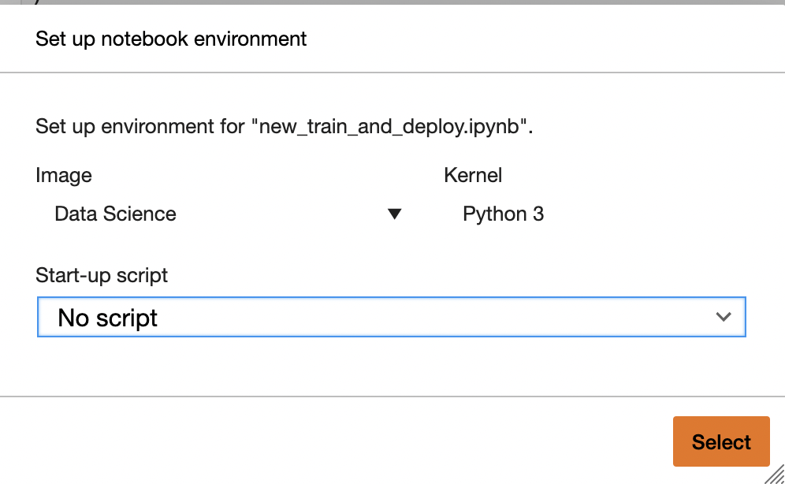
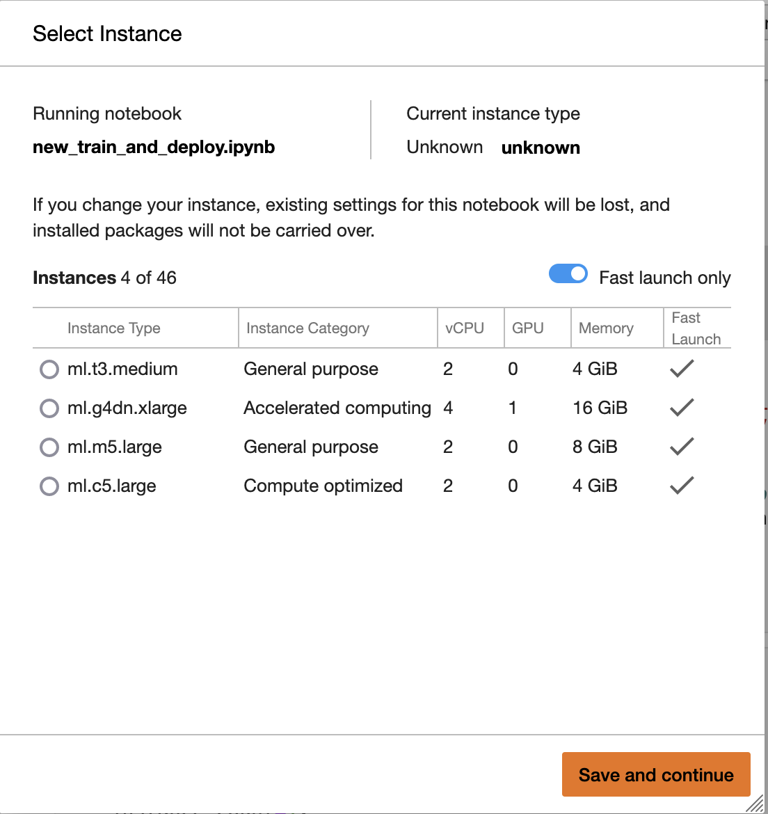
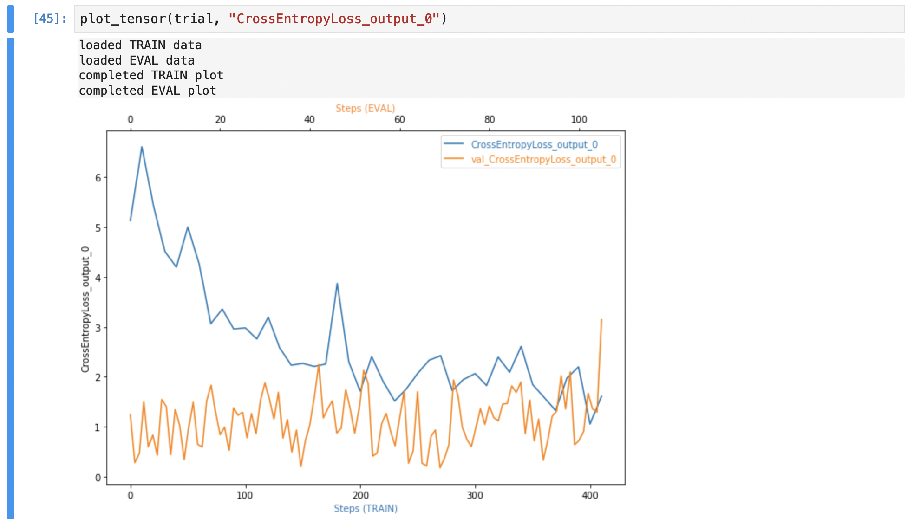

# Image Classification on AWS using SageMaker and s3
## Udacity Project 3: AWS Machine Learning Engineer Nanodegree Program (2021-2022)

The present work consists in taking a large datafile of dog images classified by breed and construct
a model to be able to predict the breeds of dogs on the test file.

For that main task several minor steps are to be executed:
1. Download the data from a public available repo using wget and unzip data into the AWS filesystem (s3)
2. Train the last layer of a pretrained model (Resnet18) usign the image the data on s# to perfrom a hyperparameter optimization.
3. Use the hyperparameters obtained in 3. to retrain the same model using the Profiling and Debugging of the model  parameters using hooks, a module avaible from SageMaker, to avoid *automagically* vanishing gradients, overfitting, overtraining, poor weight initialization and then generate a Profiler Report.
4. Deploy the model as an endpoint to perform inference on the breed of selected images. 

## Step 0: Project Set Up and Installation
You must be logged to a AWS account and search for SageMaker to get into the SageMaker console. 
Launch Sagemaker Studio.
It could take a few minutes to start. 
Once open you will be able to upload all the files of this project and run the Jupyter Notebook that comprises the whole process described above.

The files to upload are: 
`train_adn_deploy.ipynb`, running each cell will execute the whole process and three auxiliary python scripts that are called by the notebook:
`hpo.py`, contains the prediction model, the training loop as well as the validation and testing tasks in step 2 for hyperparameter optimization.
`train_model.py`, esentially identical to hpo.py, but with the hooks of SageMaker module that performs debugging of the model in step 3.
endpoint_inference.py responsible for invoking the endpoint created by the notebook and return the prediction.

Open the Jupyter Notebook and select the kernel as follows:
 

 
 
and the instance: 

 

## Step 1: Data used
The first step in the notebook is to get data from the web, unzip it, and make it available into s3.
You must generate an s3 bucket before and provide the bucket name to the corresponding cell on the notebook.
Also you must use the region global for the s3 bucket, but the region US-east-1 (N.Virginia) for the SageMaker studio.
The dataset is available at https://s3-us-west-1.amazonaws.com/udacity-aind/dog-project/dogImages.zip 
and the notebook gets it into the SageMaker filesystem by executing the linux command wget from the cell. 

## Step 2: Hyperparameter Optimization
The next part of the notebook deals with hyperparameter optimization. For that task we provide a range of the hyperparameters to investigate and the cells 
run the script `hpo.py`.
This script receives the arguments from the cell and performs the train, validation and testing processes to obtain the best combination of hyperparameters.
Then those hyperparameters are passed to the third step.

## Step 3: Debugging and Profiling
 *Debugging* 
Now we will use hooks from the SageMaker module that *automagically* corrects weights to avoid undesirable effects as 
`vanishing gradients, overfitting, overtraining or poor weight initialization`
Finally the plot of the Cross Entropy Loss is shown in a cell:
 

  

This graph serve to see if a bad behavior like the blue line with erratic oscillations or not decreasing with batches. 
In that case batches could be shuffled to try to minimize this effect.

 *Profiling* 
The profiler report is generated by the SageMaker debugger and can be seen [here](profiler/profiler-report.html).
 

 
<a href="profiler/profiler-report.html">here</a>

## Model Deployment
- Model was deployed to a "ml.t2.medium" instance type and "endpoint_inference.py" script is used to setup and deploy our working endpoint.
- For testing purposes ,few test images are stored in the "testImages" folder.
- Those images are fed to the endpoint for inference/
- The inference is performed using both the approaches. 
    1. Using the Predictor Object 
    2. Using the boto3 client.
  

